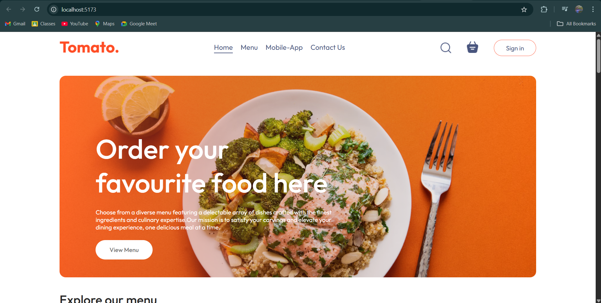
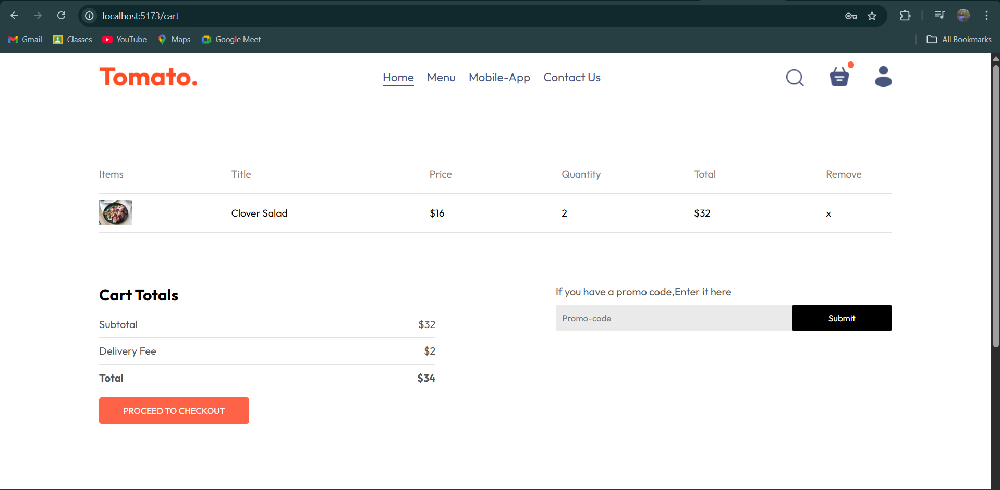
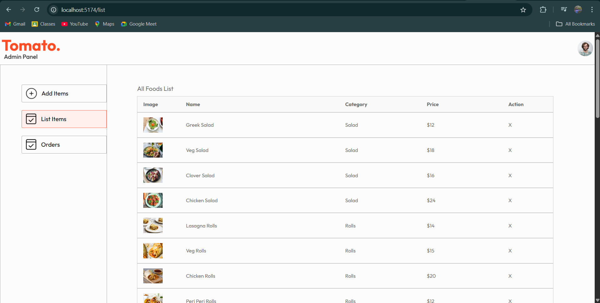
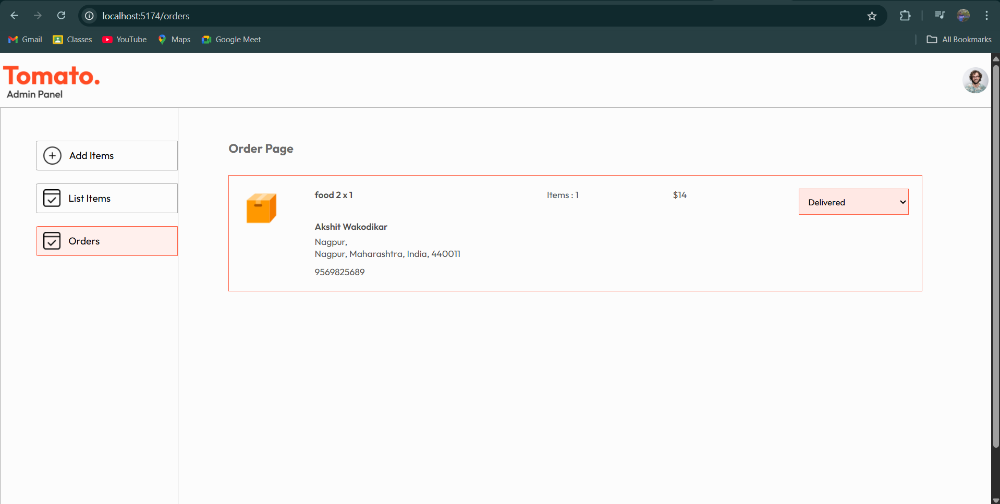

<h1 align="center">Food Delivery</h1>

<p align="center">
  <br>
  <br>
  <br>
  
</p>

# Installation

<h2>How to install/setup the Front-End</h2>

> Open a terminal in VS Code and go into the frontend folder and then run

>❗Open the frontend first [http://localhost:5173](http://localhost:5173)


```
npm install
npm run dev
```


<h2>How to install/setup the Admin Page</h2>

> Open a terminal in VS Code and go into the admin folder and then run

>❗Open the admin after the frontend. [http://localhost:5174](http://localhost:5174)

```
npm install
npm run dev
```
   
<h2>How to install/setup the Backend</h2>

> Open a terminal in VS Code and go into the backend folder and then run

```
npm run server
```

- [ ] Remember to include your Database in db.js and your Stripe Secret Key in .env
"# food-delivery" 
# food-delivery
